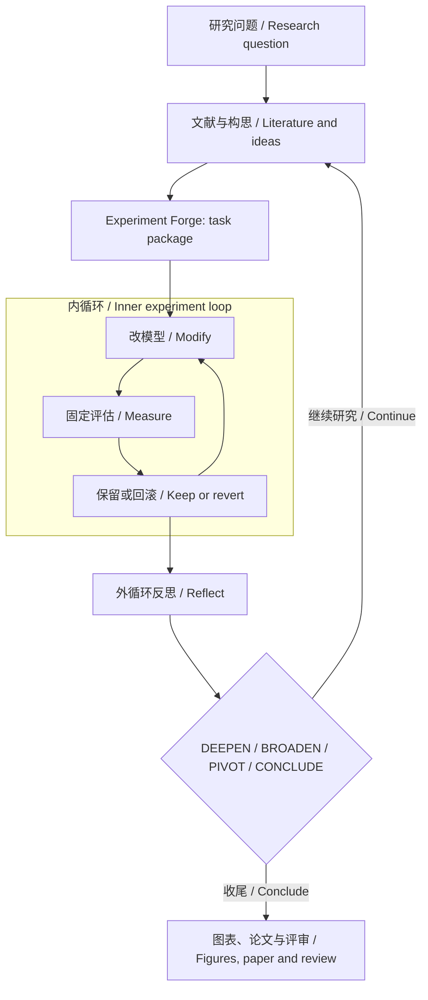

<p align="center"><a href="https://yichen-zju.github.io/claude-for-research/"></a></p>

<h1 align="center">Lemvo for Codex</h1>
<p align="center"><strong>一套自主科研体系，两种 CLI 引擎。<br>One research system. Two CLI engines.</strong><br>让想法，走到发现。 / From an idea. To a discovery.</p>
<p align="center"><a href="https://yichen-zju.github.io/claude-for-research/?lang=zh">Lemvo 中文主页</a> · <a href="https://yichen-zju.github.io/claude-for-research/?lang=en">Lemvo in English</a> · <a href="#quickstart">Quickstart</a> · <a href="https://github.com/Yichen-ZJU/claude-for-research">Lemvo for Claude Code</a></p>
<p align="center">  </p>

**Lemvo** 是运行在 Claude Code 与 Codex CLI 上的自主科研体系。**Lemvo for Codex** 把 Codex CLI 变成科研工作台：从深广度文献调研与 Idea 构思，到无人值守的模型改进试验，再到论文写作与评审，由 **Research Orchestrator** 协调全程，**115 个科研技能**提供工作流与领域方法。

选择 **Claude Code** 或 **Codex CLI**，保留同一套 Lemvo 科研流程。两个仓库各含 **115 个技能，技能名称集合一致**；工具调用与运行机制分别适配各自引擎。

**Lemvo** brings one autonomous research system to **Claude Code** and **Codex CLI**. **Lemvo for Codex** equips Codex CLI with broad and deep literature research, idea development, unattended model-improvement experiments, and paper writing and review. **Research Orchestrator** coordinates the whole journey, supported by **115 research skills** and nested experiment and reflection loops. The same skill catalogue runs on Claude Code, with engine-specific tool adaptations.

## 一套流程，两层循环 / One workflow, two loops



**内循环优化模型，外循环判断方向。** Autoresearch 在任务包的范围与预算内反复修改、测量、保留或回滚；Orchestrator 汇总实验与文献证据，决定深入、拓宽、转向或收尾，让下一轮试验服务于研究问题。

**The inner loop improves the model; the outer loop steers the research.** Autoresearch iterates within the task package's scope and budget. Orchestrator reflects on experimental and literature evidence and chooses whether to deepen, broaden, pivot, or conclude.

## 从调研到论文 / From evidence to a paper

| 阶段 / Stage | 能力 / Capability | 代表技能 / Skills |
|---|---|---|
| 调研与构思 / Research & ideation | 广度扫描、全文核验、跨领域构思、选题评价 / Map the field, verify full text, generate and evaluate ideas | `deep-research`, `literature-review`, `brainstorming-research-ideas`, `creative-thinking-for-research`, `idea-evaluator` |
| 任务包与优化 / Experiment packages & optimization | 锁定评估、开放模型文件、设定目标与预算；自主运行改→测→留/滚 / Fix evaluation, expose editable model files, set goals and budgets; run modify→measure→keep/revert | `experiment-forge`, `autoresearch`, `run-experiment`, `experiment-queue`, `experiment-watchdog` |
| 写作与评审 / Writing & review | 叙事规划、科研图表、论文起草、引用核验、对抗性评审 / Plan the narrative, build figures, draft, verify citations and review | `paper-production`, `paper-writing`, `paper-narrative`, `academic-plotting`, `research-review`, `paper-code-audit` |
| 全程协调 / Orchestration | 维护研究状态，协调内外循环，推动成果收尾 / Maintain research state, coordinate both loops and assemble deliverables | `research-orchestrator` |

### Experiment Forge → Autoresearch

Forge 将想法锻造成 **Karpathy 式任务包**：`program.md` 说明目标、预算和边界，固定数据与评估入口，明确可修改的模型或训练文件，准备依赖与结果记录。Autoresearch 接过任务包，在给定算力与时间内自主探索模型结构、训练策略等改动，以准确率、损失或吞吐等指定指标指导保留与回滚。

Forge turns an idea into a **Karpathy-style task package**: a `program.md` brief, a fixed evaluation, editable model or training files, dependencies, and a result ledger. Autoresearch executes the unattended improvement loop, using the chosen metric to guide which changes to keep or revert.

### ArXiv MCP · 全文级证据 / Full-text evidence

`search_papers → download_paper → search_paper_text`：先检索，再下载全文，在文内核验关键声明。来源、版本与 provenance 跟随产物保存，让结论可以回到原文检查。

Search papers, download full text, and check load-bearing claims inside the paper. Sources, versions and provenance travel with the outputs so the evidence can be inspected.

### 115 个技能 / 115 research skills

覆盖研究设计、实验、写作、评审、生物与分子模型、训练与对齐、多模态、模型效率、可解释性、科研图表、评测和算力追踪 **12 个分组**。例如 `alphafold2`、`peft`、`deepspeed`、`llava`、`flash-attention`、`transformer-lens`、`lm-evaluation-harness` 和 `mlflow`。

The 115 total skills span **12 groups**, including research workflows, biological models, training and alignment, multimodal models, efficiency, interpretability, figures, evaluation, and compute. [Browse the searchable skill catalogue →](https://yichen-zju.github.io/claude-for-research/#skills)

<a id="quickstart"></a>
## 快速开始 / Quickstart

先安装并登录 Codex CLI，然后在 Bash 环境中运行： / Install and sign in to Codex CLI, then run in Bash:

```bash
git clone https://github.com/Yichen-ZJU/codex-for-research.git
cd codex-for-research
./setup.sh install
```

安装器先备份技能与 AGENTS.md 到 `~/.codex-research-backups/`；可用 `./setup.sh uninstall` 撤回本仓库安装的技能。 / The installer backs up skills and AGENTS.md first; use `./setup.sh uninstall` to remove the installed skill set.

全文调研还需 ArXiv MCP： / For full-text research, install ArXiv MCP:

```bash
uv tool install arxiv-mcp-server
bash scripts/register-arxiv-mcp.sh
```

安装后开启新会话，用一个明确的问题开始，例如： / Start a new session with a concrete research question:

> 用 research-orchestrator 研究怎样改善手写数字分类器。先调研与构思，再用 experiment-forge 构造任务包，在固定评估下运行 autoresearch；结合结果反思方向，最后整理图表、实验报告和论文草稿。

> Use research-orchestrator to investigate a handwritten-digit classifier. Research and propose ideas, forge a task package, run autoresearch against a fixed evaluation, reflect on the direction, and assemble figures, an experiment report, and a paper draft.

[在主页观看内外双循环动画 / Watch the nested-loop workflow →](https://yichen-zju.github.io/claude-for-research/#walkthrough)

<sub>感谢开源仓库 / Thanks to [autoresearch](https://github.com/karpathy/autoresearch), [Feynman](https://github.com/Companion-Inc/feynman), and [AI Research Skills](https://github.com/Orchestra-Research/AI-Research-SKILLs). 各组件许可见原始文件与仓库 / Component licenses remain in their source files and repositories.</sub>

## 安装说明 / Install Notes

安装会覆盖 `~/.codex/skills/` 下同名技能并更新 `~/.codex/AGENTS.md`，原件自动备份到 `~/.codex-research-backups/<时间戳>-<PID>/`。`./setup.sh uninstall` 移除本仓库安装的技能并恢复 AGENTS.md；被覆盖的同名原件需从备份目录复制回原位（删除备份目录只是清理，不是恢复）。其他 Codex 配置不受影响。 / Installation overwrites same-name skills under `~/.codex/skills/` and updates `~/.codex/AGENTS.md`; originals are backed up under `~/.codex-research-backups/<timestamp>-<PID>/`. `./setup.sh uninstall` removes this repo's skills and restores AGENTS.md; overwritten originals must be copied back from the backup (deleting the backup only discards it). Other Codex configuration is untouched.

## 许可证 / License

本仓库原创内容以 **MIT** 发布（见 [LICENSE](LICENSE)）。第三方组件以各自许可证发布：`academic-research-suite`（vendored ARS，上游 © Cheng-I Wu）为 **CC BY-NC 4.0（仅限非商业使用）**，许可全文见其目录内 LICENSE；其余来源见上方致谢。 / Original content is released under **MIT** (see [LICENSE](LICENSE)). Third-party components keep their own licenses: `academic-research-suite` (vendored ARS, upstream © Cheng-I Wu) is **CC BY-NC 4.0 (non-commercial only)** — full license text lives in its own directory; other sources are acknowledged above.
