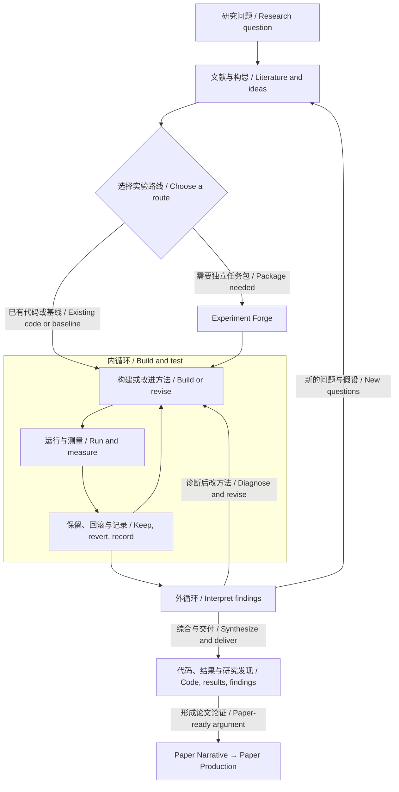

<p align="center"><a href="https://yichen-zju.github.io/lemvo/"></a></p>

<h1 align="center">Lemvo for Codex</h1>
<p align="center"><strong>会思考、会行动的科研 Agent。<br>A research agent that thinks and acts.</strong><br>一套科研体系，两种 CLI 引擎。 / One research system. Two CLI engines.</p>
<p align="center"><a href="https://yichen-zju.github.io/lemvo/?lang=zh">Lemvo 中文主页</a> · <a href="https://yichen-zju.github.io/lemvo/?lang=en">Lemvo in English</a> · <a href="#quickstart">Quickstart</a> · <a href="https://github.com/Yichen-ZJU/claude-for-research">Lemvo for Claude Code</a></p>
<p align="center">  </p>

**Lemvo** 把研究思考与实际行动接在一起：理解问题、读透文献、构建方法、选择实验，再根据结果修订下一步。**Research Orchestrator** 协调 **115 个科研技能**，通过内外双循环推进从构想到发现、再到论文的研究过程。

**Lemvo** connects research reasoning with action: understand a question, investigate the literature, build methods, choose experiments, and learn what to do next. **Research Orchestrator** coordinates **115 research skills** through two nested loops, carrying ideas into findings and findings into papers.

<p align="center"><a href="#workflow">双循环 / Two loops</a> · <a href="#routes">自主选路 / Research routes</a> · <a href="#continuity">持续研究 / Continuity</a> · <a href="#writing">论文叙事 / Paper Narrative</a> · <a href="#quickstart">开始使用 / Get started</a></p>

## 从问题出发，让研究向前 / Move research forward

| 工作 / Work | Lemvo 如何推进 / How Lemvo moves it forward |
|---|---|
| **选路 / Choose** | 从新构想、已有代码或 SOTA 复现出发，按问题与项目状态选择路线。 / Start from an idea, existing code, or a SOTA implementation; choose a route for the question and project state. |
| **行动 / Act** | 设计小试、实现方法、运行评测；需要独立交付时再锻造自驱任务包。 / Design a probe, implement a method, and evaluate it; forge a standalone task package when needed. |
| **学习 / Learn** | 综合成功与失败，定位具体问题，把诊断落实成方法改动，再验证。 / Connect successes and failures, diagnose a specific issue, revise the method, and test again. |
| **表达 / Write** | 把核心发现、证据、图序与全文组织成一条共享叙事。 / Shape the finding, evidence, figures, and manuscript into one coherent scientific story. |

<a id="workflow"></a>
## 一套流程，两层循环 / One workflow, two loops



**内循环把方法做出来、把假设测清楚；外循环解释发现、修订方法并选择下一步。** 模型优化时，Autoresearch 执行改→测→留/滚；探索研究时，实验用于区分解释、检验假设。Orchestrator 据此选择 **DEEPEN / BROADEN / PIVOT / CONCLUDE**，让一次实验成为下一轮研究的起点。

**The inner loop builds methods and tests hypotheses; the outer loop interprets findings, revises methods, and chooses the next step.** Autoresearch runs modify→measure→keep/revert for optimization. Discovery experiments distinguish explanations and test hypotheses. Orchestrator chooses **DEEPEN / BROADEN / PIVOT / CONCLUDE**, turning one experiment into the starting point for the next.

[观看手写数字例子的双循环动画 / Watch the two-loop example →](https://yichen-zju.github.io/lemvo/#walkthrough)

<a id="routes"></a>
## 按课题选路，而不是套固定流程 / Routes, not a rigid pipeline

| 起点 / Starting point | 路线 / Route |
|---|---|
| **一个问题或构想 / A question or idea** | 广度调研 → 全文精读 → 候选方法 → 小试与假设验证。 / Map the field → investigate full text → develop a method → probe and test. |
| **已有可迭代代码 / An existing codebase** | Autoresearch 就地建立运行约定与评测入口，直接迭代方法。 / Autoresearch establishes the run contract and evaluation, then iterates in place. |
| **可信 SOTA 实现 / A credible SOTA implementation** | 调研选基线 → 限时复现 → 冻结对照 → 在原代码上改进。 / Select a baseline → bound reproduction → freeze the comparison → improve the existing code. |
| **需要独立交付 / A standalone package** | Experiment Forge 锻造 Karpathy 式任务包 → Autoresearch 自驱实验。 / Experiment Forge builds a Karpathy-style task package → Autoresearch runs the experiment loop. |

已有运行契约与实验台账时，继续现有循环；**Forge 是按需选择，不是每个项目的必经门槛。** 用户指定的路线优先于自动选择。

Resume an existing loop when its run contract and ledger are present. **Forge is an option, not a mandatory first step.** An explicit user route takes precedence.

### Experiment Forge + Autoresearch

Forge 把构想锻造成可运行、可交接的任务包：`program.md` 写清目标、预算与边界，固定数据和评测入口，开放模型或训练文件，准备依赖与结果台账。Autoresearch 在约定范围内提出改动、运行评测、保留有效改进并回滚退步；准确率、损失和效率是可选择的优化目标，而实验也可以服务于机制与假设验证。

Forge turns an idea into a runnable, transferable task package: `program.md` defines the goal, budget, and scope; evaluation is fixed; model or training files remain editable; dependencies and a results ledger travel with the package. Autoresearch proposes changes, evaluates them, keeps improvements, and reverts regressions within scope. Accuracy, loss, and efficiency can guide optimization; experiments also investigate mechanisms and test hypotheses.

[任务包规范 / Task-package specification](skills/experiment-forge/SKILL.md) · [自主实验循环 / Autoresearch](skills/autoresearch/SKILL.md)

<a id="continuity"></a>
## 为持续研究设计 / Built for research that continues

| 能力 / Capability | 如何落地 / How it works |
|---|---|
| **研究记忆 / Research memory** | `research-state.yaml`、`findings.md` 与决策日志保存问题、发现、预算和下一步；续接先读已有状态。 / State, findings, and decision logs preserve the question, discoveries, budget, and next action. |
| **从准备走向小试 / From preparation to a probe** | 实现可跑、评测单位与尺度有效、预算允许时，启动最小真实探针；准备阶段有累计记录与决策点。 / Start the smallest real probe when the implementation runs, measurement is valid, and budget permits; preparation has a ledger and decision points. |
| **把诊断变成改动 / Diagnose, revise, retest** | 测量失灵先修测量，实现有错先修实现；候选无效则改方法或换候选，并保留当前最佳。 / Repair a broken measurement or implementation; revise or replace an ineffective candidate while retaining the best result. |
| **资源贯穿全程 / Budget across the project** | 续跑、转向与交接沿用累计资源记录；到达边界时明确继续、收窄或收尾，并交付已有成果。 / Carry resource records through continuation, pivots, and handoffs; at a boundary, explicitly continue, narrow, or conclude with the work preserved. |

有信息量的阴性结果也是进展：它排除一种解释、限定一种方法，或指出下一次改动。研究收尾交付代码、结果与已知发现；论文写作由论证的成熟度决定。

An informative negative result is progress: it rules out an explanation, bounds a method, or points to the next change. Research can conclude with code, results, and findings; a paper follows when the argument is ready.

[研究总控与准备纪律 / Orchestration and preparation rules](skills/research-orchestrator/SKILL.md) · [研究状态模板 / Research-state template](skills/research-orchestrator/templates/research-state.yaml)

<a id="literature"></a>
## 读透文献，构思有据 / Full-text research, evidence-led ideas

**ArXiv MCP** 提供全文工具链：`search_papers → download_paper → search_paper_text`。先梳理方法版图，再下载关键论文，在文内核验承重声明；版本、来源与 provenance 随产物保存。构思技能通过跨领域类比、反转假设和问题重构，把文献中的分歧与空白转成可检验的方法。

**ArXiv MCP** connects search, full-text retrieval, and in-paper evidence checks. Map the field, investigate the papers that matter, and keep versions, sources, and provenance with the outputs. Ideation skills transfer ideas across fields, invert assumptions, and turn unresolved questions into testable methods.

[调研 / Deep Research](skills/deep-research/SKILL.md) · [文献综述 / Literature Review](skills/literature-review/SKILL.md) · [构思 / Research Ideas](skills/brainstorming-research-ideas/SKILL.md)

<a id="writing"></a>
## Paper Narrative：让发现有主线 / Give the discovery a coherent story

**Paper Narrative** 从核心贡献出发，建立一份共享叙事计划，组织问题、洞见、方法、主张与证据。摘要抓住核心发现，Introduction 建立问题张力，章节与图序推进论证，结尾回答开篇问题、留下新的认识。后续发现改变时，计划与全文一起对齐。

**Paper Narrative** starts with the contribution and creates one shared narrative plan connecting the question, insight, method, claims, and evidence. The abstract captures the finding; the introduction establishes the problem; sections and figures advance the argument; the conclusion answers the opening question. As findings evolve, the plan and manuscript evolve together.

| 叙事路线 / Narrative lens | 论证重点 / Argument |
|---|---|
| 根因手术刀 / Root-cause scalpel | 从失效现象走向机制解释与针对性设计。 / Connect a failure pattern to its mechanism and a targeted design. |
| 反直觉重构 / Counter-intuitive reframing | 重审默认设定，建立更有解释力的视角。 / Revisit a default assumption and establish a more useful perspective. |
| 理论照亮经验 / Theory illuminates practice | 用形式化结果建立新的理解。 / Use formal results to establish a new understanding. |
| 新基准暴露失效 / Benchmarks expose failure | 把被忽略的问题变成可测量、可解释的发现。 / Make overlooked failures measurable and interpretable. |
| 社会价值叙事 / Societal value | 围绕真实需求解释技术选择与应用价值。 / Connect technical choices to real needs and application value. |
| 极简统一美学 / A unifying principle | 用共同原则串起多个问题与结果。 / Connect multiple problems and results through one principle. |

主线按贡献选择、融合；效率改进等工作也可以采用自身最清晰的证据叙事。**Paper Production** 接续全文起草、科研图表、引用核验与写作评审，把研究记录推进到论文交付。

Choose or combine lenses for the contribution; an efficiency paper can use a direct efficiency narrative. **Paper Production** connects drafting, scientific figures, citation verification, and writing review to deliver the manuscript.

[Paper Narrative](skills/paper-narrative/SKILL.md) · [Paper Production](skills/paper-production/SKILL.md) · [在主页查看写作能力 / Explore writing on the homepage →](https://yichen-zju.github.io/lemvo/#write)

## 115 个技能，两种引擎 / 115 skills, two engines

两个仓库各含 **115 个技能，名称集合一致**。研究约定与流程同源，工具调用、子代理与续接机制按宿主适配。覆盖研究、实验、写作、评审、生物模型、训练与对齐、多模态、模型效率、可解释性、图表、评测和算力管理 **12 个主题分组**。

Both repositories contain **115 skills with the same names**. Research conventions and workflows are shared; tool use, subagents, and continuation are adapted to each CLI. The catalogue spans **12 curated groups** across research workflows and specialist methods.

[浏览可搜索技能库 / Browse the searchable skill catalogue →](https://yichen-zju.github.io/lemvo/#skills)

<a id="quickstart"></a>
## 快速开始 / Quickstart

先安装并登录 Codex CLI，再在 Bash 环境中运行： / Install and sign in to Codex CLI, then run in Bash:

```bash
git clone https://github.com/Yichen-ZJU/codex-for-research.git
cd codex-for-research
./setup.sh install
```

安装器会备份同名技能与 AGENTS.md。全文检索需另行配置 ArXiv MCP： / Existing matching skills and AGENTS.md are backed up. Configure ArXiv MCP for full-text retrieval:

```bash
uv tool install arxiv-mcp-server
bash scripts/register-arxiv-mcp.sh
```

开启新会话，给出问题、项目路径和预算： / Start a new session with the question, project path, and budget:

> 用 research-orchestrator 开始研究：问题是……，已有代码与数据在……，可用算力与时间预算是……。请选择合适路线，准备就绪后启动最小真实实验，根据结果改进方法、检验解释，并持续保存研究状态。形成完整贡献后，用共享 Paper Narrative 组织摘要、Introduction、图表与结尾。

> Use research-orchestrator to study … . My code and data are in … ; my compute and time budget are … . Choose a route, launch the smallest real experiment when ready, revise the method and test explanations from the results, and preserve research state. When the contribution is ready, use a shared Paper Narrative to connect the abstract, introduction, figures, and conclusion.

### 跨轮次续接 / Continue across turns

Codex CLI 提供按项目保存会话 ID 的[参考外层驱动](skills/research-orchestrator/templates/autoloop-reference.sh)。每次调用推进一轮，后续通过同一会话 ID 续接；可接入自己的调度器。项目已建立状态与运行环境后，单轮调用示例：

Codex CLI includes a [reference outer-loop driver](skills/research-orchestrator/templates/autoloop-reference.sh) that saves a session ID per project. Each invocation advances one turn; subsequent invocations resume the same session. Connect it to your scheduler after establishing the project state and environment:

```bash
bash "$HOME/.codex/skills/research-orchestrator/templates/autoloop-reference.sh" /absolute/path/to/project
```

驱动读取准备预算与阻塞状态，保存累计轮次和时间。冷启动读取明确的状态摘要；它不会自动替换已有战役的启动器。

The driver checks preparation budgets and blocking states, and preserves cumulative turns and time. Cold starts use an explicit state summary. Existing project launchers are not replaced automatically.

<sub>感谢开源仓库 / Thanks to [autoresearch](https://github.com/karpathy/autoresearch), [Feynman](https://github.com/Companion-Inc/feynman), and [AI Research Skills](https://github.com/Orchestra-Research/AI-Research-SKILLs). 各组件许可见原始文件与仓库 / Component licenses remain in their source files and repositories.</sub>

## 安装说明 / Install Notes

安装会覆盖 `~/.codex/skills/` 下同名技能并更新 `~/.codex/AGENTS.md`，原件自动备份到 `~/.codex-research-backups/<时间戳>-<PID>/`。`./setup.sh uninstall` 移除本仓库安装的技能并恢复 AGENTS.md；被覆盖的同名原件需从备份目录复制回原位（删除备份目录只是清理，不是恢复）。其他 Codex 配置不受影响。 / Installation overwrites same-name skills under `~/.codex/skills/` and updates `~/.codex/AGENTS.md`; originals are backed up under `~/.codex-research-backups/<timestamp>-<PID>/`. `./setup.sh uninstall` removes this repo's skills and restores AGENTS.md; overwritten originals must be copied back from the backup (deleting the backup only discards it). Other Codex configuration is untouched.

## 许可证 / License

本仓库原创内容以 **MIT** 发布（见 [LICENSE](LICENSE)）。第三方组件以各自许可证发布：`academic-research-suite`（vendored ARS，上游 © Cheng-I Wu）为 **CC BY-NC 4.0（仅限非商业使用）**，许可全文见其目录内 LICENSE；其余来源见上方致谢。 / Original content is released under **MIT** (see [LICENSE](LICENSE)). Third-party components keep their own licenses: `academic-research-suite` (vendored ARS, upstream © Cheng-I Wu) is **CC BY-NC 4.0 (non-commercial only)** — full license text lives in its own directory; other sources are acknowledged above.
